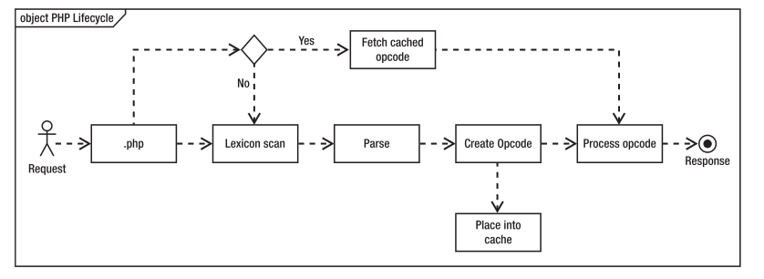

# PHP的Zend Opcache字节码缓存

## 概述

字节码缓存不是PHP的新特性，有很多独立的扩展可以实现，比如APC、eAccelerator和Xache等，但是截至目前这些扩展都没有集成到PHP内核，从PHP 5.5.0开始，PHP内置了字节码缓存功能，名为Zend Opcache。

开始之前，我们先来看看什么是字节码缓存，以及字节码缓存的作用是什么。

众所周知，PHP是解释型语言，构建在Zend 虚拟机之上，PHP解释器在执行PHP脚本时会解析PHP脚本代码，把PHP代码编译成一系列Zend操作码（ [opcode](http://php.net/manual/zh/internals2.opcodes.php)，由于每个操作码都是一个字节长，所以又叫字节码，字节码可以直接被Zend虚拟机执行），然后执行字节码。每次请求PHP文件都是这样，这会消耗很多资源，如果每次HTTP请求都必须不断解析、编译和执行PHP脚本，消耗的资源更多。如果PHP源码不变，相应的字节码也不会变化，显然没有必要每次都重新生成Opcode，结合在Web应用中无处不在的缓存机制，我们可以把首次生成的Opcode缓存起来，这样下次直接从缓存取，岂不是很快？下面是启用Opcode缓存之前和之后的流程图：

字节码缓存能存储预先编译好的PHP字节码，这样，下次请求PHP脚本时，PHP解释器不用每次读取、解析和编译PHP代码，直接从内存中读取预先编译好的字节码，然后立即执行，这样能省很多时间，极大提升应用的性能。

## 启用Zend Opcache

> 注：如果使用Windows开发环境，或者使用brew或apt-get等命令安装的PHP可以略过编译步骤。

默认情况下，Zend Opcache没有开启，需要我们在编译时使用`--enable-opcache`指定启用Zend Opcache。

编译好PHP后还需要在php.ini中指定Opcache扩展路径：

	zend_extension=/path/to/opcache.so
    
一般而言PHP编译成功后会显示Zend Opcache扩展路径，但如果想不起来，可以使用如下命令找到PHP扩展所在目录:

	php -ini | grep extensions
    
>[info] 注：如果你使用Xdebug，需要在php.ini中先加载Zend Opcache，再加载Xdebug。

重启后，查看phpinfo

	php -info | grep Opcache

## 配置Zend Opcache

启用Zend Opcache后还需要在php.ini中配置Zend Opcache，下面是一份配置示例作为参考：

    opcache.validate_timestamps=1    // 生产环境中配置为0
    opcache.revalidate_freq=0    //检查脚本时间戳是否有更新时间
    opcache.memory_consumption=64    //Opcache的共享内存大小，以M为单位
    opcache.interned_strings_buffer=16    //用来存储临时字符串的内存大小，以M为单位
    opcache.max_accelerated_files=4000    //Opcache哈希表可以存储的脚本文件数量上限
    opcache.fast_shutdown=1         //使用快速停止续发事件

> [官网配置参考](http://ua2.php.net/manual/zh/opcache.configuration.php。)

## 使用Zend Opcache

Zend Opcache使用起来很简单，因为启用之后它会自动运行，Zend Opcache会自动在内存中缓存预先编译好的PHP字节码，如果缓存了某个文件的字节码，就执行对应的字节码。

如果php.ini中配置了opcache.validate_timestamps值为0，需要小心，因为Zend Opcache将不能觉察PHP脚本的变化，**必须手动清空Zend OPcache缓存的字节码**，才能让它发现PHP文件的变动。这个配置适合在生产环境中设置为0，但在开发环境会带来不便，我们可以在开发环境中这样配置启用自动验证缓存功能：

	opcache.enable=1 # 启用操作码缓存,默认为“1”, 如果禁用此选项，则不会优化和缓存代码。
    opcache.revalidate_freq=0 #  检查脚本时间戳是否有更新的周期，以秒为单位。设置为 0 会导致针对每个请求， OPcache 都会检查脚本更新。
    opcache.validate_timestamps=1 # 如果启用，那么 OPcache 会每隔 opcache.revalidate_freq 设定的秒数 检查脚本是否更新。
    

## 手动清理缓存

除了重启php-fpm的进程可以清理opcache缓存外，
手动清理缓存涉及到的opcache函数主要为：opcache_reset()和opcache_invalidate() 。

	boolean opcache_reset ( void ) # 该函数将重置整个字节码缓存。 在调用 opcache_reset() 之后，所有的脚本将会重新载入并且在下次被点击的时候重新解析。
    

>[warning] 需要注意的是，当PHP以PHP-FPM的方式运行的时候，opcache的缓存是无法通过php命令进行清除的，只能通过http或cgi到php-fpm进程的方式来清除缓存。