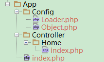

# 通过命名空间实现自动加载的框架雏形

## 了解命名空间

namespace是PHP5.3版本加入的新特性，用来解决在编写类库或应用程序时创建可重用的代码如类或函数时碰到的两类问题：

1. 用户编写的代码与PHP内部的类/函数/常量或第三方类/函数/常量之间的名字冲突。
2. 为很长的标识符名称(通常是为了缓解第一类问题而定义的)创建一个别名（或简短）的名称，提高源代码的可读性。

PHP 命名空间中的元素使用了类似文件系统的原理（同一目录下不允许有两个相同名称的文件）。例如，类名可以通过三种方式引用：

1. 非限定名称，或不包含前缀的类名称，例如 `$a=new foo()`; 或 `foo::staticmethod()`;。如果当前命名空间是 `currentnamespace`，`foo` 将被解析为 `currentnamespace\foo`。如果使用 foo 的代码是全局的，不包含在任何命名空间中的代码，则 foo 会被解析为foo。 **警告：如果命名空间中的函数或常量未定义，则该非限定的函数名称或常量名称会被解析为全局函数名称或常量名称。详情参见 使用命名空间：后备全局函数名称/常量名称。**

2. 限定名称,或包含前缀的名称，例如 `$a = new subnamespace\foo();` 或 `subnamespace\foo::staticmethod();`。如果当前的命名空间是 `currentnamespace`，则 foo 会被解析为 `currentnamespace\subnamespace\foo`。如果使用 foo 的代码是全局的，不包含在任何命名空间中的代码，foo 会被解析为`subnamespace\foo`。

3. 完全限定名称，或包含了全局前缀操作符的名称，例如， `$a = new \currentnamespace\foo()`; 或 `\currentnamespace\foo::staticmethod();`。在这种情况下，foo 总是被解析为代码中的文字名`(literal name)currentnamespace\foo`。
另外注意访问任意全局类、函数或常量，都可以使用完全限定名称，例如 `\strlen()` 或 `\Exception` 或 `\INI_ALL`。**如果代码是在命名空间内，那基本上是必须以完全限定名称来声明使用**

```php
<?php
use My\Full\Classname as Another, My\Full\NSname; //别名导入,如果不用as就是最后一级的名称

$obj = new Another; // 实例化一个 My\Full\Classname 对象(非限定名称)
$obj = new \Another; // 实例化一个Another对象(完全限定名称)
$obj = new Another\thing; // 实例化一个My\Full\Classname\thing对象(限定名称,限定最后一级)
$obj = new \Another\thing; // 实例化一个Another\thing对象(完全限定名称)

$a = \strlen('hi'); // 调用全局函数strlen
$b = \INI_ALL; // 访问全局常量 INI_ALL
$c = new \Exception('error'); // 实例化全局类 Exception
?>
```

## PSR-0 与 PSR-4

PSR是由PHP Framework Interoperability Group（PHP通用性框架小组）发布的一系列标准/规范,目前官方发布文件版本

    PSR-0(已弃用)
    PSR-1 基本代码规范
    PSR-2 代码风格规范
    PSR-2 补充文档
    PSR-3 日志接口规范
    PSR-4 自动载入
    PSR-5和PSR-6投票还未通过

PSR-0就是其中的自动加载标准，其后的PSR-4称为改进的自动加载的标准，是PSR-0的补充。所以，PSR-0虽然被弃用了，但是我们还是了解一下。

1. 命名空间必须与绝对路径一致
1. 类名首字母必须大写，并且与文件名相同
1. 除去入口文件外，其他“.php”必须只有一个类
1. php类文件必须自动载入，不采用include等
1. 单一入口

>[info] 命名空间还为PHP-FIG制定的PSR-4自动加载标准奠定了坚实的基础，现在的框架基本上都是基于`psr-4`来加载（内部spl_autoload_register加载时，通过命名空间知道其具体的绝对路径）, 其核心就是
> 作为“命名空间前缀”，其必须与至少一个“文件基目录”相对应；
> 所谓的文件基目录： 
> 
> > 1. 文件根目录
> > 2. omposer.json里面定义的psr-4，比如psr-4定义了/app， 那/app/service/class1.php 其命名空间就是app/service;  `new app/service/class1` 都可以自动加载
> > 3. 框架中提前定义好的，比如tp5中的extend目录， extend/libs/log.php  其命名空间可以直接是libs，因为其在自动加载时会自动加上extend目录，来加载

参考：

[PHP-FIG/PSR-4-autoloader-cn.md](https://github.com/PizzaLiu/PHP-FIG/blob/master/PSR-4-autoloader-cn.md)


## 一个简单的PSR-0的框架模型



`\index.php`

```php
<?php
define('BASEURL' , __DIR__);
require_once(BASEURL . '/Config/Loader.php');
spl_autoload_register('\\Config\\Loader::autoload');
Controller\Home\index::tbb();
```

`Config\Loader.php`
```php
<?php
namespace Config;
class Loader{
  public function test(){
    echo __DIR__ , "\n"; // 通过Config\Loader::test()调用;由此可见已经和路径一致,更便于代码的阅读
  }

  //需要被spl_autoload_register注册的autoloader函数必须是static;
  static function autoload($class){
    //echo $class; // 连命名空间也一起打印出来的,所以根据这个命名空间的特性再加上PSR-0规范的基础上可以做类自动加载是很方便的;
    $class = BASEURL . '/' . str_replace('\\' , '/' , $class) . '.php'; //Linux系统的目录都是以/来分割的,同时windows系统虽然以\来分割目录,但也识别/来分割,可以做一个替换;
    require_once($class);
  }
}
```

`Controller\Home\index`

```php
<?php
namespace Controller\Home;
class index{
  public function tbb(){
    echo 'i am tbb,hahahah~';
  }
}
```

